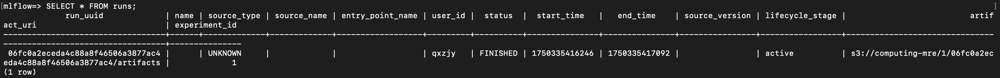

# Getting started
1. Start/create cluster :
```shell
minikube start
```

2. See Chart values :
```shell
helm show values bitnami/postgresql > psql-values.yaml
```

3. Install Chart cluster :
```shell
helm install psql bitnami/postgresql -f config.yaml
# See STDOUT further on this documentation
```

4. Test/use DB :
```shell
export POSTGRES_PASSWORD=$(kubectl get secret --namespace default psql-postgresql -o jsonpath="{.data.password}" | base64 -d)

kubectl run psql-postgresql-client --rm --tty -i --restart='Never' --namespace default \
--image docker.io/bitnami/postgresql:17.5.0-debian-12-r12 --env="PGPASSWORD=$POSTGRES_PASSWORD" \
--command -- psql --host psql-postgresql -U qxzjy -d mlflow -p 5432

# \dt => show table
# \db => show db
# \du => show user
# SELECT * FROM table;
```

5. Load deployment configuration : 
```shell
kubectl apply -f mlflow-deployment.yaml
```

6. Load service configuration :
```shell
kubectl apply -f mlflow-service.yaml
```

7. Load secrets configuration :
```shell
kubectl apply -f secrets.yaml
```

8. Launch service :
```shell
minikube service mlflow-service
```

9. Stop cluster :
```shell
minikube stop
```

10. Delete cluster :
```shell
minikube delete
```

  
STDOUT from `helm install psql bitnami/postgresql -f psql/config.yaml`
```shell                                 
(base) qxzjy@macmax optimize-ml-traking % helm install psql bitnami/postgresql -f psql/config.yaml 
NAME: psql
LAST DEPLOYED: Thu Jun 19 13:57:08 2025
NAMESPACE: default
STATUS: deployed
REVISION: 1
TEST SUITE: None
NOTES:
CHART NAME: postgresql
CHART VERSION: 16.7.12
APP VERSION: 17.5.0

Did you know there are enterprise versions of the Bitnami catalog? For enhanced secure software supply chain features, unlimited pulls from Docker, LTS support, or application customization, see Bitnami Premium or Tanzu Application Catalog. See https://www.arrow.com/globalecs/na/vendors/bitnami for more information.

** Please be patient while the chart is being deployed **

PostgreSQL can be accessed via port 5432 on the following DNS names from within your cluster:

    psql-postgresql.default.svc.cluster.local - Read/Write connection

To get the password for "postgres" run:

    export POSTGRES_ADMIN_PASSWORD=$(kubectl get secret --namespace default psql-postgresql -o jsonpath="{.data.postgres-password}" | base64 -d)

To get the password for "qxzjy" run:

    export POSTGRES_PASSWORD=$(kubectl get secret --namespace default psql-postgresql -o jsonpath="{.data.password}" | base64 -d)

To connect to your database run the following command:

    kubectl run psql-postgresql-client --rm --tty -i --restart='Never' --namespace default \
    --image docker.io/bitnami/postgresql:17.5.0-debian-12-r12 --env="PGPASSWORD=$POSTGRES_PASSWORD" \
    --command -- psql --host psql-postgresql -U qxzjy -d mlflow -p 5432

    > NOTE: If you access the container using bash, make sure that you execute "/opt/bitnami/scripts/postgresql/entrypoint.sh /bin/bash" in order to avoid the error "psql: local user with ID 1001} does not exist"

To connect to your database from outside the cluster execute the following commands:

    kubectl port-forward --namespace default svc/psql-postgresql 5432:5432 &
    PGPASSWORD="$POSTGRES_PASSWORD" psql --host 127.0.0.1 -U qxzjy -d mlflow -p 5432

WARNING: The configured password will be ignored on new installation in case when previous PostgreSQL release was deleted through the helm command. In that case, old PVC will have an old password, and setting it through helm won't take effect. Deleting persistent volumes (PVs) will solve the issue.

WARNING: There are "resources" sections in the chart not set. Using "resourcesPreset" is not recommended for production. For production installations, please set the following values according to your workload needs:
  - primary.resources
  - readReplicas.resources
  
```

Result after RUN :
